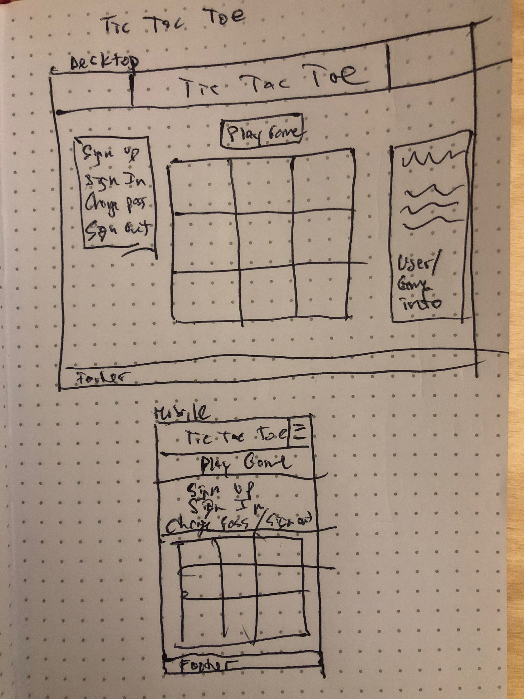

# Tic Tac Toe: GA Project 1

This application allows a user to sign up for an account and play multiple
rounds of tic-tac-toe. Game data can be displayed for the user including
total games completed, win/loss/tie ratio, and win percentage.

### Technologies Used:

  -Core web technologies: HTML, CSS, JavaScript.

  -jQuery used for DOM manipulation.

  -AJAX used for api requests.

  -Bootstrap used to aid styling and layout.

  -Animate.css used for basic animations of the gameboard and player display on load and on click.

### Important Links:

  Deployed API: https://tic-tac-toe-wdi-production.herokuapp.com

  Deployed client: https://asooge.github.io/tic-tac-toe/

### Planning and development process:

  Began planning with a basic wireframe layout of what I wanted the page to
  look like. Emphasis was put on the mobile layout to make the game attractive
  and accessible to the largest possible audience. From there, basic html layout was
  completed and simple CSS styling to create the layout of the page and the
  game board. I wanted the user authorization process to be included all in
  one form, and responsive to the state of the user (signed in or not) so I
  created a variable called status that would track the status of the user
  authorization. When sign up, sign in, change password, or sign out was clicked,
  the page would respond dynamically by showing and hiding html elements as
  appropriate.

  The submit button would now require the neccesary data from the form depending
  on the status and send an ajax request to the api only if neccessary data was
  included in the user input. Once user was signed in, the "play game" button
  would appear which would start the game on click.

  Once the layout and user authorization were completed and functional, I moved
  on to the game functionality. the "play game" button would start the game by
  triggering an ajax request to create a new game. The game data would then be
  stored to the global 'store' object. Each click of the board would register
  with a dataset corresponding to the index of the square (0-8) and player x
  or player o would be tracked in the global 'store' object. This information
  would be used to update the api with each move, check for a winner, and
  display the results on the gameboard.

  Once there was a winner, the ui would update to display which player won the
  game, and the 'play game button' would reappear so the user can play another
  game with a fresh gameboard and create a new game object.

  At any time, the signed-in user can sign out, and change their password,
  as well as display game data based on their history.

### User Stories:

1) As a user I want to be able to sign in and log my game history/data.

2) As a user I want access to my game data win/loss/tie ratios.

3) As a user I want to be able to save a game state and return upon next login

4) As a user I want to be able to play against the computer.

5) As a user I want to play the game on my phone with all the same functionality.

### Unsolved problems to fix in future iterations:

  Would like to enable playing against a computer in future iterations.
  Difficulty settings will be easy, medium, and hard.

  Also, noticed that following a win, the other player can very quickly make a
  move, because a winner is not declared until after the api is called and
  patched with the winning move. This is a minor bug/glitch. A possible
  solution to this problem would be to update the game array on the client side
  and determine a winner, before patching the api. This way the client will
  determine and annouce a winner in a synchronous fashion and not allow another move.

  I'm satisfied with the mobile layout, but would like to update the layout on desktop so that the user authorization and game data is on
  the left side of the page, with the gameboard taking up the remainder of the page. A possible solution would be to use flex box and or
  bootstrap containers.

  Additionally, could use further styling to improve on the color scheme and font-family. SASS would be useful in coordinating styling for the page.

### Wireframes:

